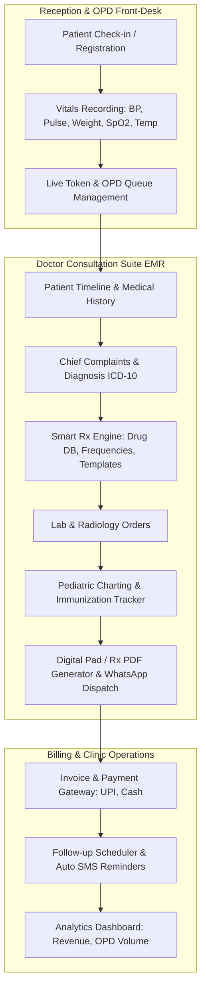

# 🏥 DocOn Reverse-Engineering: Master Architectural Blueprint & Implementation Roadmap

## 1. Executive Summary & Product Teardown
**DocOn** is one of India's most popular Clinic Management & Electronic Medical Record (EMR) platforms used by thousands of doctors (General Physicians, Pediatricians, Gynaecologists, Specialists). 

Its core strength is **ultra-fast clinical workflows (generating a complete prescription in < 30 seconds)** combined with receptionist OPD queue management, automated patient engagement (WhatsApp/SMS), vaccination tracking, and billing.

---

## 2. DocOn Core Architecture & Reverse-Engineered Modules



---

## 3. Phase-by-Phase Execution Roadmap

```
  ┌─────────────────────────────────────────────────────────────┐
  │  PHASE 1: Foundation, RBAC & Multi-Clinic Architecture     │
  ├─────────────────────────────────────────────────────────────┤
  │  PHASE 2: Receptionist Front-Desk & Live OPD Queue Engine   │
  ├─────────────────────────────────────────────────────────────┤
  │  PHASE 3: Smart Prescription & EMR Core (The DocOn Magic)  │
  ├─────────────────────────────────────────────────────────────┤
  │  PHASE 4: Pediatric Specialization & Immunization Engine   │
  ├─────────────────────────────────────────────────────────────┤
  │  PHASE 5: Billing, Invoicing & WhatsApp/SMS Automation     │
  ├─────────────────────────────────────────────────────────────┤
  │  PHASE 6: Patient Portal & Teleconsultation Integration    │
  ├─────────────────────────────────────────────────────────────┤
  │  PHASE 7: Analytics, Reports & Practice Growth Engine       │
  └─────────────────────────────────────────────────────────────┘
```

---

### 🔹 Phase 1: Multi-Tenant Clinic & Role-Based Access Control (RBAC)
**Goal:** Setup multi-clinic, multi-staff infrastructure supporting Doctor, Receptionist, Nurse, and Clinic Admin roles.

- **Data Models:**
  - `Clinic`: Name, address, phone, GST, logo, letterhead settings, consultation fees.
  - `Staff / User`: Roles (`doctor`, `receptionist`, `nurse`, `clinic_admin`, `patient`), clinic affiliations, schedule/timings.
  - `DoctorProfile`: Specialization, qualifications, registration number, digital signature, default Rx layout.
- **Key Deliverables:**
  - Multi-clinic switching for visiting doctors.
  - Role-specific dashboard routing (Doctor Consultation Suite vs Receptionist Counter).

---

### 🔹 Phase 2: Reception Front-Desk & OPD Queue Management
**Goal:** Manage walk-in & online patients, live token queue, and preliminary vitals triage.

- **Data Models:**
  - `Patient`: UHID (Unique Hospital ID), full name, phone, age/DOB, gender, blood group, allergies, chronic conditions.
  - `Appointment / Token`: Token number, status (`waiting`, `with_doctor`, `completed`, `cancelled`), arrival time, visit type.
  - `Vitals`: BP (Systolic/Diastolic), Pulse, SpO2, Temperature, Weight, Height, BMI, RBS/FBS.
- **Key Deliverables:**
  - **Live OPD TV Display & Counter View**: Real-time token caller screen.
  - Quick patient lookup by mobile number or UHID (< 3 keystrokes).
  - Vitals entry modal with automatic BMI calculator and abnormal vital warning badges.

---

### 🔹 Phase 3: Smart Prescription Engine (The Core DocOn Experience)
**Goal:** Build a lightning-fast clinical consultation screen where doctors write prescriptions in < 30 seconds.

- **Data Models:**
  - `Prescription`: Patient ID, Doctor ID, Clinic ID, Date, Chief Complaints, Diagnosis, Clinical Notes, Medicines, Investigations, Follow-up date.
  - `MedicineDatabase`: Brand name, generic composition, form (Tab/Cap/Syr/Inj), strength, default instructions.
  - `RxTemplate`: Saved favorite drug sets (e.g., "Viral Fever Kit", "Hypertension Starter", "Pedia Cold").
- **Key Deliverables:**
  - **Auto-suggest Rx Engine**: Instant search for 50,000+ Indian brand/generic drugs.
  - **One-click Dosage Calculator**: Frequency (`1-0-1`, `1-0-0`, `1-1-1`), timing (*After Food / Before Food*), duration (*5 Days*).
  - **Customizable Letterhead PDF Exporter**: Generate clean, professional Rx PDF ready for thermal/A4 printing or direct WhatsApp delivery.

---

### 🔹 Phase 4: Pediatric & Specialist Module (DocOn Signature Feature)
**Goal:** DocOn's primary competitive edge — advanced pediatric growth tracking and vaccine scheduling.

- **Data Models:**
  - `ImmunizationSchedule`: IAP (Indian Academy of Pediatrics) standard vaccine chart (Birth, 6w, 10w, 14w, 6m, 9m, 12m, 15m, 18m, 5y).
  - `GrowthRecord`: Height, weight, head circumference tracking.
- **Key Deliverables:**
  - **WHO Percentile Growth Curves**: Interactive charts plotting child's growth vs WHO standard percentiles.
  - **Vaccine Manager**: Given date, due date, brand given, batch number, next upcoming vaccine auto-reminders.

---

### 🔹 Phase 5: Billing, Invoicing & WhatsApp Automation
**Goal:** Seamless clinic billing with instant WhatsApp communication.

- **Data Models:**
  - `Invoice`: Bill number, consultation fee, procedure charges, discounts, taxes, payment mode (Cash, UPI, Card), payment status.
- **Key Deliverables:**
  - 1-click invoice generation linked with consultation.
  - Automated WhatsApp message with PDF prescription link and follow-up appointment reminder.

---

### 🔹 Phase 6: Patient Portal & Teleconsultation
**Goal:** Dedicated portal for patients to view medical records and book appointments.

- **Key Deliverables:**
  - Mobile-responsive patient timeline: Past prescriptions, lab reports, invoices.
  - Online appointment booking link for clinic website/QR code.
  - Video consultation room with WebRTC.

---

### 🔹 Phase 7: Analytics, Reports & Practice Growth
**Goal:** Business intelligence and clinical insights for doctors.

- **Key Deliverables:**
  - Daily OPD volume, average wait time, patient retention rate.
  - Revenue breakdown by cash/UPI/card.
  - Top prescribed medicines and frequent diagnoses reports.
