# 🛡️ Docpa Master Security Roadmap: Enterprise Healthcare Security & Compliance Architecture

## 1. Executive Summary & Healthcare Security Standards
Healthcare applications handling **Electronic Medical Records (EMR)**, **Protected Health Information (PHI)**, and **Personally Identifiable Information (PII)** are subject to strict regulatory compliances and high-risk threat vectors.

This Master Security Roadmap outlines a defense-in-depth security architecture tailored for Docpa, aligned with:
- **HIPAA** (Health Insurance Portability and Accountability Act) Security & Privacy Rules
- **DISHA / ABDM** (Digital Information Security in Healthcare Act / Ayushman Bharat Digital Mission - India)
- **OWASP Top 10 API Security Risks (2023/2026 Edition)**
- **ISO 27001 & SOC 2 Type II** Controls

---

## 2. 7-Layer Defense-in-Depth Security Matrix

```mermaid
graph TD
    subgraph Layer 1: Edge & Network Security
        N1[Cloudflare / WAF] --> N2[TLS 1.3 Strict HTTPS / HSTS]
        N2 --> N3[IP Throttling & DDoS Protection]
    end

    subgraph Layer 2: API Gateway & Request Hygiene
        N3 --> G1[Helmet Security Headers]
        G1 --> G2[CORS Strict Whitelist]
        G2 --> G3[Tiered Rate Limiting]
        G3 --> G4[Payload Size Capping 10kb]
    end

    subgraph Layer 3: Identity & Session Fortress
        G4 --> I1[Dual-Factor / OTP Verification]
        I1 --> I2[Short-Lived JWT Access Tokens]
        I2 --> I3[Rotating Refresh Tokens in HttpOnly Cookies]
        I3 --> I4[Session Invalidation & Device Fingerprinting]
    end

    subgraph Layer 4: Multi-Tenant Authorization & IDOR Defense
        I4 --> A1[Clinic Tenant Boundary Guard]
        A1 --> A2[Granular Role-Based Access Control RBAC]
        A2 --> A3[Resource Ownership & ABAC Checks]
    end

    subgraph Layer 5: Data Integrity & Injection Defense
        A3 --> D1[Joi / Zod Strict Request Validation]
        D1 --> D2[MongoDB NoSQL Injection Sanitization]
        D2 --> D3[DOMPurify / XSS Neutralization]
    end

    subgraph Layer 6: Cryptography & PHI Protection
        D3 --> C1[AES-256-GCM Field-Level PHI Encryption]
        C1 --> C2[Argon2id / Bcrypt 12-Round Password Hashing]
        C2 --> C3[Cryptographic Salted Token Generation]
    end

    subgraph Layer 7: Audit Logging & Forensic Telemetry
        C3 --> L1[Immutable PHI Access Audit Logs]
        L1 --> L2[Security Anomaly Alerting Webhooks]
        L2 --> L3[Automated Data Retention & Scrubbing]
    end
```



---

## 3. Phase-by-Phase Security Roadmap

```
  ┌──────────────────────────────────────────────────────────────────┐
  │  PHASE 1: Identity, Authentication & Anti-Brute-Force Hardening  │
  ├──────────────────────────────────────────────────────────────────┤
  │  PHASE 2: Strict Multi-Tenant Isolation & Zero-Trust IDOR Shield │
  ├──────────────────────────────────────────────────────────────────┤
  │  PHASE 3: Deep Input Sanitization & Anti-Injection Guards       │
  ├──────────────────────────────────────────────────────────────────┤
  │  PHASE 4: Cryptography, Field-Level PHI/PII Encryption           │
  ├──────────────────────────────────────────────────────────────────┤
  │  PHASE 5: API Edge Defense, Rate Limiting & Header Fortification│
  ├──────────────────────────────────────────────────────────────────┤
  │  PHASE 6: Immutable Forensic Audit Trails (HIPAA/ABDM Ready)     │
  ├──────────────────────────────────────────────────────────────────┤
  │  PHASE 7: Secrets Management, Dependency Scanning & CI/CD SAST   │
  └──────────────────────────────────────────────────────────────────┘
```

---

### 🔹 Phase 1: Identity, Authentication & Anti-Brute-Force Hardening
**Objective:** Eliminate credential stuffing, token hijacking, session replay, and unauthorized account access.

#### 1.1 Token Architecture & Lifecycle
- **Access Tokens:** Short-lived (15 minutes lifespan) signed with `RS256` (Asymmetric Public/Private key) or high-entropy `HS512` secret.
- **Refresh Tokens:** Long-lived (7 days) stored securely with **Refresh Token Rotation (RTR)**. Every refresh generates a new pair and revokes the old one. If an old token is reused, all family sessions are automatically purged (Theft Detection).
- **Transport:** Delivered via `HttpOnly`, `Secure`, `SameSite=Strict` cookies to completely neutralize XSS-based token theft.

#### 1.2 Multi-Factor & OTP Hardening
- **Cryptographic OTP Generation:** Use `crypto.randomInt(100000, 999999)` instead of insecure `Math.random()`.
- **OTP Hashing:** OTPs stored in MongoDB hashed with `bcrypt`/`argon2id` (never stored in plaintext).
- **TTL Expiry:** Enforce 5-minute strict self-destructing TTL index.
- **Attempt Capping:** Maximum 3 incorrect OTP attempts before locking for 15 minutes.
- **Resend Throttle:** Minimum 60-second cooldown between OTP requests.

#### 1.3 Anti-Brute Force & Account Lockout
- Dynamic account lockouts: 5 failed consecutive login attempts lock the account for 15 minutes with security alert emails dispatched.
- Exponential backoff delays on consecutive failed authentication calls.

---

### 🔹 Phase 2: Strict Multi-Tenant Isolation & Zero-Trust IDOR Shield
**Objective:** Guarantee that no staff member or doctor from Clinic A can ever access or leak patient, prescription, or billing records belonging to Clinic B (Insecure Direct Object References - IDOR).

#### 2.1 Multi-Tenant Context Injection Middleware (`tenantGuard`)
- Extract `clinic_id` from verified session/JWT or user's `active_clinic_id`.
- Automatically inject `{ clinic_id: user.active_clinic_id }` into all database queries (`find`, `findOne`, `update`, `delete`).
- Prevent URL manipulation where an attacker alters IDs in endpoints like `/api/v1/patients/:id` or `/api/v1/invoices/:id`.

#### 2.2 Granular Role-Based Access Control (RBAC) & Attribute-Based (ABAC)
- **Role Hierarchy:**
  - `super_admin`: Platform management only (no direct clinical viewing without audited consent).
  - `clinic_admin`: Staff management, billing, clinic settings.
  - `doctor`: Patient diagnosis, prescription issuing, vaccine charts, teleconsultation.
  - `receptionist`: Patient check-in, token generation, vitals entry, billing collection.
  - `nurse`: Vitals triage, vaccine status updating.
  - `patient`: View personal health timeline only.
- Strict route-level and action-level authorization checks: Doctors can only edit their own issued prescriptions before finalization; receptionists cannot view doctor confidential clinical notes.

---

### 🔹 Phase 3: Deep Input Sanitization & Anti-Injection Guards
**Objective:** Neutralize all forms of NoSQL Injection, Stored/Reflected Cross-Site Scripting (XSS), Server-Side Request Forgery (SSRF), and Parameter Pollution.

#### 3.1 Strict Schema Validation Layer
- Validate 100% of incoming `req.body`, `req.params`, and `req.query` using Joi/Zod validators with `stripUnknown: true` to prevent mass-assignment vulnerabilities.
- Reject requests containing unexpected or polymorphic payloads.

#### 3.2 NoSQL Query Sanitization
- Implement query sanitization to strip `$` and `.` operators from user input (e.g. preventing `{"$gt": ""}` bypasses in MongoDB queries).

#### 3.3 HTML & Rich-Text Neutralization
- Sanitize all clinical notes, doctor advice, and template inputs using `DOMPurify` / `xss` filters before persistence.
- Escape all rendered output on prescription and invoice HTML layouts.

---

### 🔹 Phase 4: Cryptography & Field-Level PHI/PII Encryption
**Objective:** Protect sensitive medical data at rest so that even a direct database dump does not expose patient identities or medical conditions.

#### 4.1 Field-Level Encryption (Envelope Encryption / AES-256-GCM)
- Encrypt highly sensitive patient fields at rest before writing to MongoDB:
  - Patient Aadhaar / National ID / Government ID
  - Chronic condition notes / Sensitive psychiatric/diagnostic markers
  - Emergency contact details
- Cryptographic initialization vectors (IV) generated uniquely per record.

#### 4.2 Password & Credential Hashing
- Use `argon2id` (memory-hard, GPU-resistant) or `bcrypt` (12 salt rounds) for user credentials.
- Zero plaintext storage of API keys, client secrets, or integration credentials.

---

### 🔹 Phase 5: API Edge Defense, Rate Limiting & Header Fortification
**Objective:** Protect the API layer from Denial of Service (DoS), slowloris, clickjacking, MIME-sniffing, and automated bot scraping.

#### 5.1 Tiered Rate Limiters
- **Global API Rate Limiter:** 100 requests per 15 minutes per IP.
- **Authentication Rate Limiter:** 5 requests per 15 minutes per IP on `/login`, `/send-otp`, `/verify-otp`.
- **Search Rate Limiter:** 30 requests per minute on `/medicines/search` and `/patients/search` to prevent automated scraping of patient lists and medicine catalogs.
- **Public TV Display Limiter:** Polling-optimized caching or WebSocket events to reduce load.

#### 5.2 Security Headers via Helmet
- `Content-Security-Policy (CSP)`: Strict script-src and frame-ancestors directives.
- `Strict-Transport-Security (HSTS)`: `max-age=31536000; includeSubDomains; preload` to enforce HTTPS.
- `X-Frame-Options: DENY`: Prevents UI clickjacking attacks.
- `X-Content-Type-Options: nosniff`: Prevents MIME confusion exploits.
- `Referrer-Policy: strict-origin-when-cross-origin`.

#### 5.3 Request Payload Limits & Timeout Protection
- Body parser capped strictly at `10kb` for JSON payloads (prevents Memory Exhaustion DoS).
- Request timeout protection (15 seconds maximum per HTTP transaction).

---

### 🔹 Phase 6: Immutable Forensic Audit Trails (HIPAA/ABDM Ready)
**Objective:** Maintain an unalterable, cryptographically signed log of every interaction with Protected Health Information (PHI).

#### 6.1 Audit Log Schema (`AuditLogModel`)
- **Actor:** `user_id`, `name`, `role`, `clinic_id`
- **Action:** `PATIENT_RECORD_VIEW`, `RX_ISSUED`, `RX_MODIFIED`, `VITALS_RECORDED`, `INVOICE_GENERATED`, `STAFF_PERMISSION_CHANGED`
- **Target:** `resource_type` (Patient, Prescription, Invoice), `resource_id`
- **Context:** IP Address, User-Agent, Timestamp, Changes diff (before/after)
- **Retention:** 7-year tamper-evident log storage (HIPAA compliance).

#### 6.2 Security Telemetry & Anomaly Alerts
- Automated Slack / Discord / Webhook notifications triggered on:
  - 3+ failed admin logins from an unrecognized IP
  - Bulk patient data export attempts
  - Privilege escalation attempts

---

### 🔹 Phase 7: Secrets Management, Dependency Scanning & CI/CD SAST
**Objective:** Ensure code supply-chain integrity, zero secret leakage, and automated vulnerability remediation.

#### 7.1 Secret Scanning & Environment Hardening
- `.env` secrets never committed to Git (`.gitignore` enforced with pre-commit hooks).
- Production secrets stored in AWS Secrets Manager / HashiCorp Vault / Doppler.

#### 7.2 Automated Security Scans (SAST & DAST)
- Automated `npm audit` and Snyk checks in CI/CD pipeline to block vulnerable dependencies.
- Semgrep static analysis rules targeting healthcare data leaks and unvalidated queries.

---

## 4. Implementation Priority & Checklist

| Priority | Security Control | Module / File | Impact |
| :--- | :--- | :--- | :--- |
| 🔴 **P0 (Critical)** | Multi-Tenant IDOR Guard (`tenantGuard.js`) | `middleware/tenantGuard.js` | Prevents cross-clinic data leaks |
| 🔴 **P0 (Critical)** | Secure Crypto OTP & Brute-force throttling | `services/otpService.js`, `middleware/rateLimiter.js` | Blocks account takeover |
| 🔴 **P0 (Critical)** | NoSQL Injection Sanitizer (`express-mongo-sanitize`) | `server.js` | Neutralizes query manipulation |
| 🟡 **P1 (High)** | PHI Access Audit Logging Middleware | `middleware/auditLogger.js`, `models/AuditLogModel.js` | HIPAA/ABDM legal compliance |
| 🟡 **P1 (High)** | Refresh Token Rotation in HttpOnly Cookies | `utils/jwtUtil.js`, `controllers/userController.js` | Neutralizes token theft & XSS |
| 🟢 **P2 (Standard)** | Field-Level AES-256 Encryption for Aadhaar/Govt IDs | `utils/cryptoUtil.js`, `models/PatientModel.js` | Data-at-rest protection |
| 🟢 **P2 (Standard)** | Specialized Search & Auth Rate Limiters | `middleware/rateLimiter.js` | Prevents scraping & DoS |
